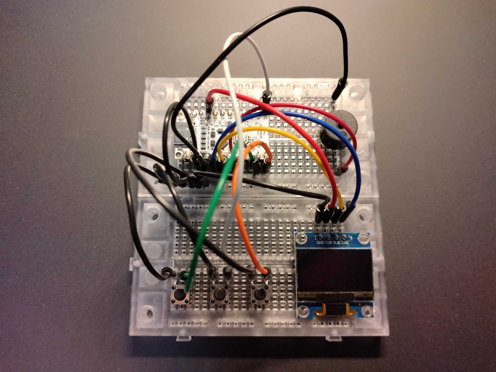

# CH32V003 Arduino Mini Game

UIAPduino Pro Micro CH32V003 V1.4、128×64 I2C OLED、3 ボタン、
圧電ブザーで動く、落下物を避けるミニゲームです。実機でコンパイル、書き込み、
表示、入力、サウンドまで動作確認しています。

[](docs/assets/gameplay-demo.mp4)

画像をクリックすると、実機でゲームを操作している約 8 秒の動画を再生できます。

## 構成

- UIAPduino Pro Micro CH32V003 V1.4
- 128×64 I2C OLED（SSD1306/SSD1315、アドレス `0x3C` または `0x3D`）
- タクトスイッチ × 3
- 圧電ブザー × 1
- ブレッドボード

購入候補と費用:

- [秋月電子でそろえる部品](docs/parts-akizuki.md)
- [スイッチサイエンスでそろえる部品](docs/parts-switch-science.md)

## 遊び方

起動後に ACTION を押すとゲームが始まります。

- LEFT: 左へ移動
- RIGHT: 右へ移動
- ACTION: ゲーム開始、ゲームオーバー後の再開
- 落下物を避ける
- 避けるたびに画面上部の点が増える
- 8 点ごとに落下速度が上がる（最大速度あり）
- 衝突すると低い音が鳴り、画面に枠が表示される

## 配線


| UIAPduino | GPIO | 配線色 | 接続先 |
| --- | --- | --- | --- |
| `3V3` | - | 赤 | OLED `VDD` |
| `GND` | - | 黒 | GND 共通線 |
| `D3` | `PC1` | 青 | OLED `SDA` |
| `D4` | `PC2` | 黄 | OLED `SCK/SCL` |
| `D5` | `PC3` | 紫 | ブザー `+` |
| `D8` | `PC6` | 緑 | LEFT |
| `D9` | `PC7` | 橙 | RIGHT |
| `D10` | `PD0` | 白 | ACTION |

```text
                         UIAPduino CH32V003
                      ┌──────────────────────┐
 OLED SDA ── blue ────┤ D3  PC1             │
 OLED SCL ── yellow ───┤ D4  PC2             │
 BUZZER + ── purple ───┤ D5  PC3             │
 LEFT ───── green ─────┤ D8  PC6             │
 RIGHT ──── orange ────┤ D9  PC7             │
 ACTION ─── white ─────┤ D10 PD0             │
 OLED VDD ─ red ───────┤ 3V3                 │
 GND rail ─ black ─────┤ GND                 │
                      └──────────────────────┘

                       GND rail
                          │
             ┌────────────┼────────────┐
             │            │            │
          OLED GND     BUZZER -     BUTTONS
                                      │
                               LEFT / RIGHT / ACTION
```

OLED の `GND`、ブザーの `-`、各ボタンの反対側、UIAPduino の `GND` を、
すべてブレッドボードの GND 共通線へ接続します。

配線色は必須ではありません。表と図の色は動作確認した実機の配線です。

### ボタン

ボタンは `INPUT_PULLUP` を使用するため、外付けプルアップ抵抗は不要です。

```text
GPIO ──── button ──── GND
```

- 未押下: `HIGH`
- 押下: `LOW`

スケッチ内では次の設定に対応します。

```cpp
pinMode(8, INPUT_PULLUP);   // LEFT  / PC6
pinMode(9, INPUT_PULLUP);   // RIGHT / PC7
pinMode(10, INPUT_PULLUP);  // ACTION / PD0
```

### ピン配置

主要ピンを含む V1.4 の配置は次のとおりです。

```text
                    USB-C
              ┌──────────────┐
              │  UIAPduino   │
              │   CH32V003   │
              │              │
 TX / A5 / 15 │ PD5      5V  │
 RX / A6 / 16 │ PD6     GND  │
          GND │         RESET│ PD7
          GND │          3V3 │
  SDA / D3    │ PC1   D12/A3 │ PD2
  SCL / D4    │ PC2    D6/A2 │ PC4
 LED / D2     │ PC0    D0/A1 │ PA1
       D5     │ PC3    D1/A0 │ PA2
       D11    │ PD1       D7 │ PC5
  SCK / D7    │ PC5       D9 │ PC7
 MOSI / D8    │ PC6       D8 │ PC6
 MISO / D9    │ PC7      D10 │ PD0
              └──────────────┘
```

この配置は [UIAPduino Pro Micro CH32V003 V1.4 の公式ピンアウト](https://www.uiap.jp/en/uiapduino/pro-micro/ch32v003/v1dot4)
と UIAPduino Arduino core `1.0.42` のピン定義に照合しています。

このゲームで使う信号ピンは次の 6 本です。

```text
PC1 / D3   I2C SDA
PC2 / D4   I2C SCL
PC3 / D5   buzzer
PC6 / D8   LEFT
PC7 / D9   RIGHT
PD0 / D10  ACTION
```

`PD1 / D11` は SWIO 用なので、ゲームの配線には使用しません。

## 起動音と OLED 診断

起動時のブザーは OLED の診断も兼ねます。

- 高い短音 1 回: OLED を `0x3C` または `0x3D` で検出
- 低い音 3 回: OLED から応答なし（電源、GND、SDA、SCL を確認）

画面が表示されず低い音が 3 回鳴る場合は、`3V3` と `GND`、`D3/PC1` の
SDA、`D4/PC2` の SCL を順番に確認します。ブレッドボード配線でも安定するよう、
I2C は 100 kHz で動作します。

## コンパイルと書き込み

Arduino IDE で [`ch32v003_arduino_game.ino`](ch32v003_arduino_game.ino) を開き、
**Tools > Board > UIAPduino > Pro Micro CH32V003** を選択します。

1. **Verify** でコンパイルする。
2. UIAPduino を write-standby モードにする。
3. **Upload** を押し、`Image written.` を確認する。
4. リセットしてゲームを起動する。

初回書き込み、Seamless Switch、USB 権限、
`Could not initialize any supported programmers` の対処は
[CH32V003 Arduino Blink の書き込み手順](../ch32v003_arduino_blink/README.md#書き込み)
と [Tips / FAQ](../ch32v003_arduino_blink/README.md#tips--faq) を参照してください。

動作確認時の使用量は flash 14,648 / 16,384 bytes（89%）、RAM 880 / 2,048
bytes（42%）でした。機能追加時は特に flash の残量に注意してください。

## テスト

ゲームルールは Arduino API から分離しているため、ホスト上でもテストできます。

```sh
g++ -std=c++14 -Wall -Wextra -Werror \
  tests/game_logic_test.cpp -o /tmp/game_logic_test
/tmp/game_logic_test
```

`arduino-cli` が `PATH` にある場合のターゲット向けコンパイル例:

```sh
arduino-cli compile \
  --fqbn UIAP:ch32v:CH32V00x_EVT:pnum=CH32V003V1DOT4,upload_method=minichlink \
  ch32v003_arduino_game
```

## 実装方針

ゲームルールは [`game_logic.h`](game_logic.h) に分離し、Arduino API に依存せず
ホスト上でテストできます。左右同時押しは相殺し、障害物が高速になっても
1 ピクセルずつ衝突判定するため、プレイヤーを飛び越えません。

表示には外部ライブラリを使用せず、SSD1306/SSD1315 を `Wire` から直接制御します。
128 バイトのページバッファで描画し、128×64 全画面の 1 KiB フレームバッファは
使用しません。RAM と flash が小さい CH32V003 で動かすための構成です。
